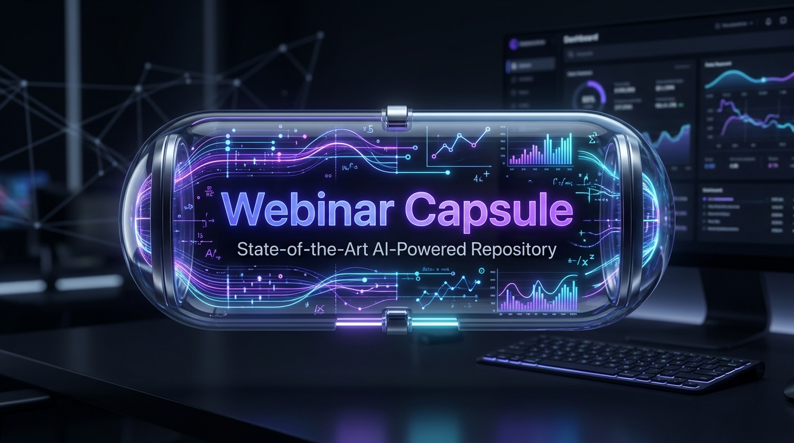
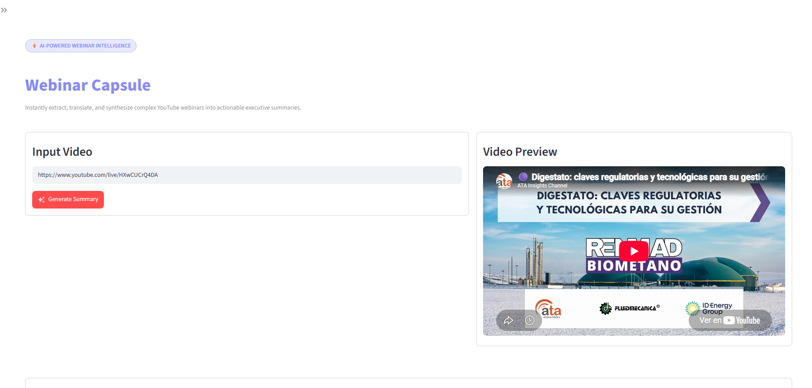

<p align="center">
  
</p>

# ⚡ Webinar Capsule

> **Instantly extract, translate, and synthesize complex YouTube webinars into clean, structured executive summaries.**

Webinar Capsule is a premium, developer-friendly tool that solves the problem of finding time to watch multi-hour technical and regulatory webinars. By combining robust transcript retrieval, automatic local audio transcription fallback (using Whisper), and state-of-the-art LLMs, Webinar Capsule generates highly detailed, structured summaries including speaker-by-speaker breakdown, key metrics, legal/regulatory decrees, and audience Q&A highlights.

---

## ✨ Key Features

- **🌐 Smart Multi-Language Caption Retrieval**: Automatically queries YouTube transcripts prioritizing configurable languages (e.g. Spanish, English, French, German, Italian).
- **🎙️ Automatic Local Whisper Fallback**: If a video lacks captions, Webinar Capsule automatically downloads the audio stream and transcribes it locally using `faster-whisper`.
- **🤖 Modular LLM Integration**: Comes built-in with Google Gemini support (e.g., `gemini-3.1-flash-lite`, `gemini-2.5-pro` with automatic exponential backoff retry logic) and is prepared for OpenAI / Anthropic models.
- **💾 Local Caching & Supabase Sync**: Saves raw transcripts and formatted summaries locally to avoid redundant API hits. Can seamlessly back up to Supabase database.
- **🖥️ Responsive UI & CLI**: Run it through an interactive, glassmorphic Streamlit Dashboard or directly via the command line interface.

---

## 🚀 Installation & Setup

### 1. Clone & Sync Dependencies
This project uses `uv` for lightning-fast package management:
```bash
# Clone the repository
git clone https://github.com/your-username/webinar-capsule.git
cd webinar-capsule

# Sync virtual environment & install packages
uv sync
```

### 2. Install System Dependencies (For Whisper Audio Fallback)
If captions are disabled on the video, the tool needs `ffmpeg` to extract and process audio streams:
- **Windows**: `winget install "FFmpeg (Essentials Build)"`
- **Mac**: `brew install ffmpeg`
- **Linux**: `sudo apt install ffmpeg`

### 3. Environment Variables Setup
Copy the configuration template:
```bash
cp .env.example .env
```
Open `.env` and fill in your keys:
```env
# Required for primary summarization
GEMINI_API_KEY=AIzaSy...

# Optional: Swap or extend the pipeline with other providers
OPENAI_API_KEY=sk-proj-...
ANTHROPIC_API_KEY=sk-ant-...

# Optional: Sync transcripts and summaries to a Supabase database
SUPABASE_URL=https://...
SUPABASE_KEY=sb_publishable...
```

---

## 🛠️ Usage

### 📊 Option A: Streamlit Interactive UI
Launch the beautiful enterprise dashboard to process links in a visual interface:
```bash
uv run streamlit run app.py
```

<p align="center">
  
</p>

### 💻 Option B: Command Line Interface (CLI)
For quick terminal operations or automated shell scripting:
```bash
# Basic run (default outputs to summaries/ directory)
uv run youtube-summarizer "https://www.youtube.com/watch?v=dQw4w9WgXcQ"

# Advanced run specifying language priority and custom model
uv run youtube-summarizer "https://youtu.be/dQw4w9WgXcQ" \
    --output-dir my_summaries/ \
    --model gemini-2.5-pro \
    --language en,es \
    --verbose
```

#### CLI Parameters
| Argument | Description | Default |
|---|---|---|
| `url` | **Required** YouTube video URL. | - |
| `--output-dir` | Directory where transcripts and summaries are saved. | `summaries/` |
| `--model` | LLM model to use. | `gemini-3.1-flash-lite` |
| `--language` | Comma-separated languages to prioritize. | `es,en,fr,de,it` |
| `--no-save` | Disable caching and filesystem persistence. | `False` |
| `--verbose` | Output detailed execution logs to stdout. | `False` |
| `--quiet` | Silence stdout output (only output errors). | `False` |

---

## 🧪 Testing & QA
Run the full test suite with:
```bash
uv run pytest
```
The test suite validates:
- **URL Parsing**: Extracting video IDs from multiple styles of YouTube links.
- **Transcript Extraction**: Fallbacks, language handling, and caching.
- **LLM Prompt Formatting**: Retry loops and rate-limiting resilience.
- **UI & CLI Integration**: Fully simulated pipelines.

---

## 📜 License
This project is licensed under the MIT License.
